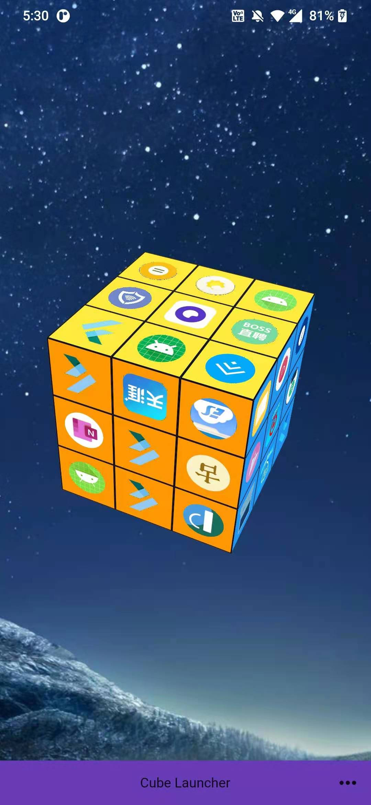
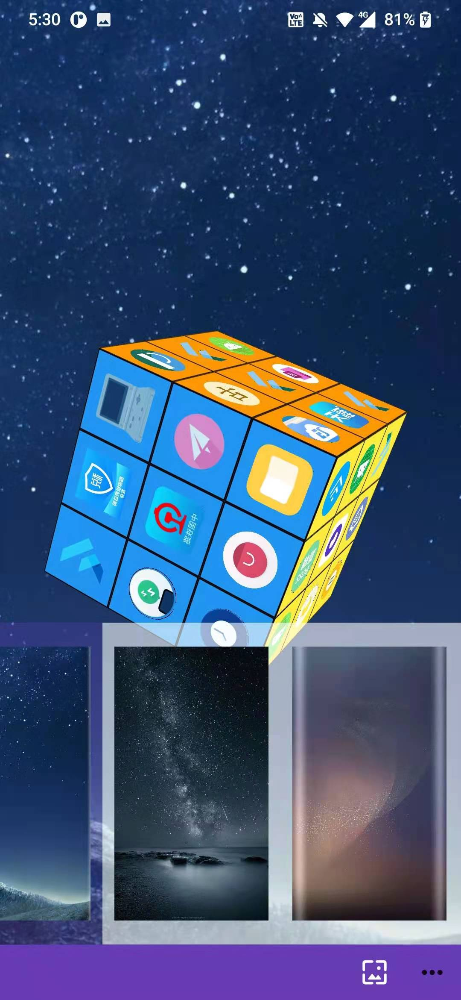
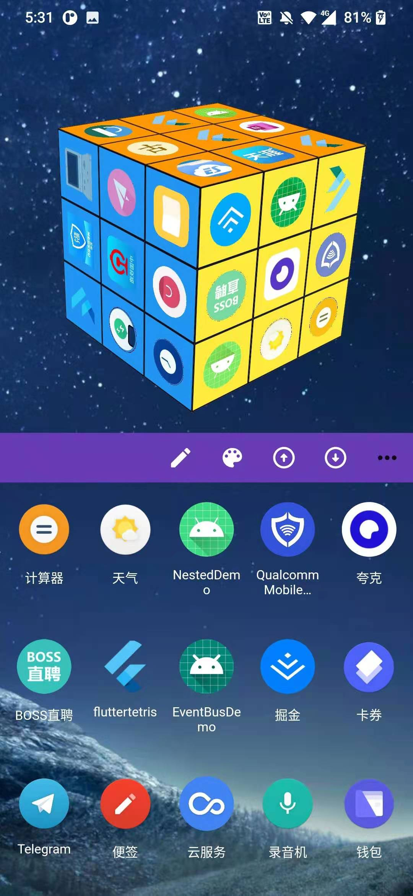
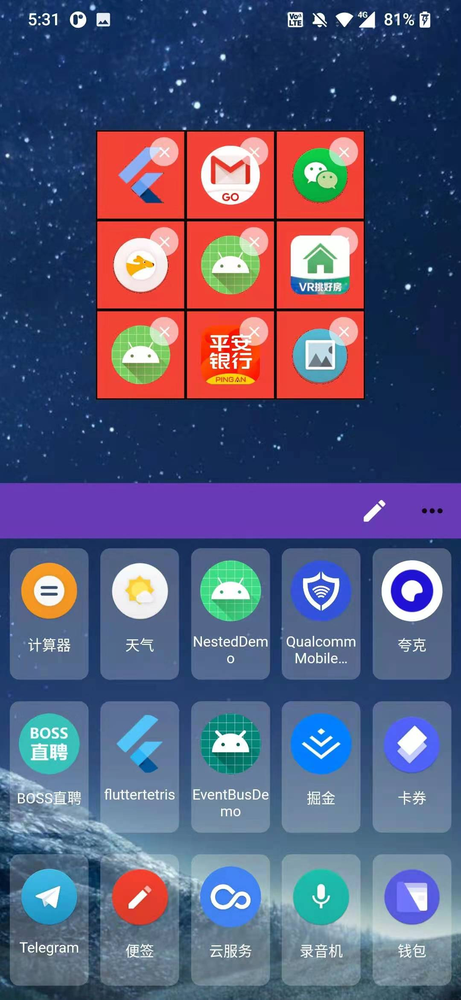
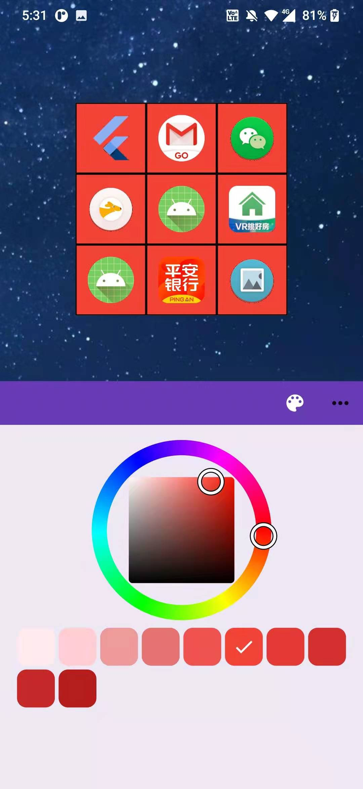
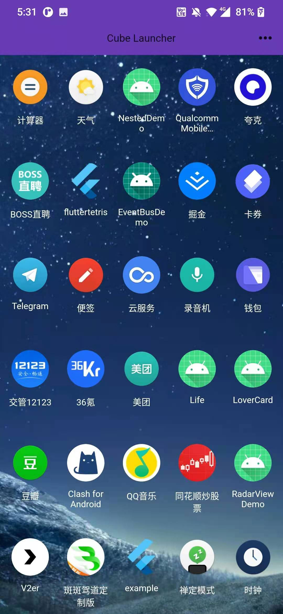

# cube_launcher 魔方桌面

## 介绍

3D的魔方桌面，使用应用图标作为方块，在玩弄（旋转、扭动）魔方的同时，点击图标打开相应的App。

支持：  

* 自定义配置魔方方块
* 魔方配色 
* 修改壁纸

## 预览

### 视频

https://user-images.githubusercontent.com/13930019/134501049-6d3cfbfc-44bd-43e9-b316-aea3b918ef7c.mp4  

https://user-images.githubusercontent.com/13930019/141263512-95a4bc6e-716f-43cc-b3fa-248712b0cb33.mp4

### 图片

   

   

## 感谢

https://github.com/likang/Hacube
